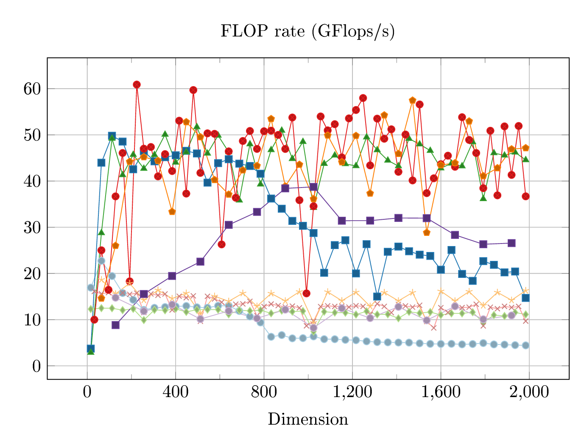
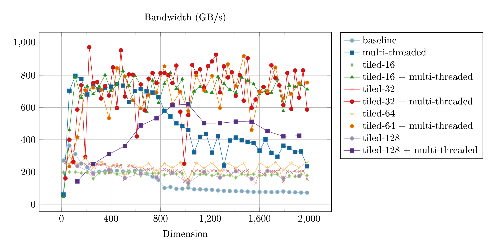
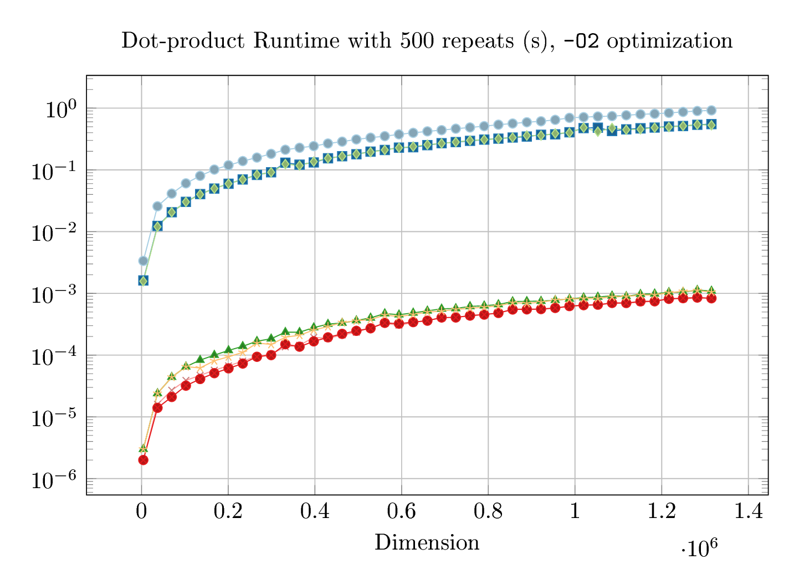
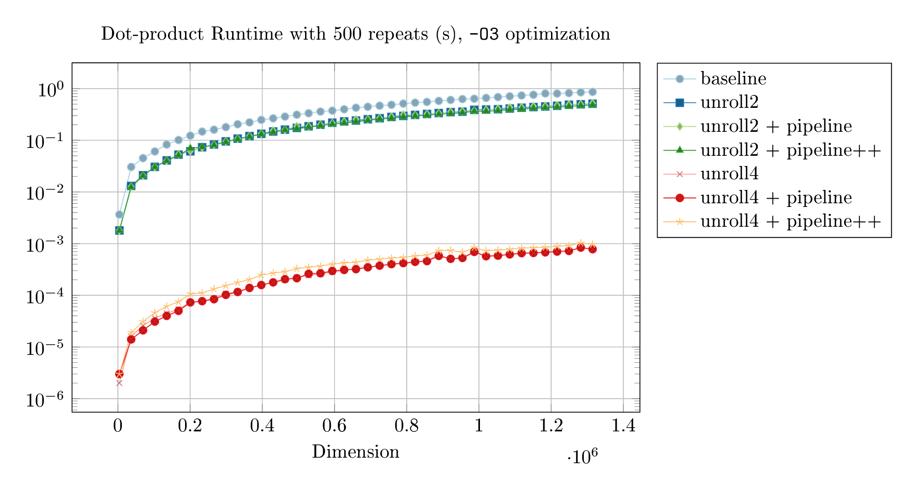

# Homework 2

**gcc**: version 12.2.0

**Hardware**: The following experiments all use the [Intel i5-8250U Kaby-Lake
architecture CPU](https://en.wikichip.org/wiki/intel/core_i5/i5-8250u), with a
3.7 GHz with 4 cores and 8 threads. It has a L1 cache size of 256 KiB, L2 cache
size of 1 MB, and L3 cache size of 6 MB, meaning,


- L1 can fit three `100 x 100` `double` matrices or two `double` vectors of length `N=16000`. 
- L2 can fit three `200 x 200` double mats or two `double` vectors of length `N=62500`.
- L3 can fit three `500 x 500` double mats of two `double` vectors of length `N=375000`.

It has a listed max bandwidth of 36 GB/s, 
though this is likely corresponding to interactions with RAM. The chip is AVX256 capable with 
two floating point units (FPUs) \[[1](https://github.com/Dr-Noob/peakperf)\].

## 1. Finding memory bugs using valgrind
### `test01`
`val_test01.cpp` computes the first 10 Fibonacci numbers. It contains two
memory errors,
1. the loop in `f` goes too far, accessing and writing to un-allocated memory.
2. `malloc`'d memory is freed using `delete`. This has undefined behavior, 
    and is fixed by instead using `free`.

### `test02`
`val_test02.cpp` fails to initialize array before doing computations with its
values. Notably, `memcheck` does not notice this unless an uninitialized value
is printed, and as such an error is only thrown on line `104`. This program is
simply fixed by extending the initialization loop to touch all values.

Bugs in both programs were found and confirmed to be fixed using `valgrind
--tool=memcheck [programfile]`.

## 2. Optimizing matrix-matrix multiplication

### Loop ordering
A naive implementation of matrix matrix multiplication (MMM) by copying the MMM
as inner-product formula $C_{ij} = \sum_k A_{ik}B_{kj}$,
```
for(i=0; i<M; i++)
    for(j=0; j<N; j++)
        for(k=0; k<P; k++)
            C[i,j] += A[i,k]*B[k,j];
```
Where $C \in \mathbf{R}^{M\times N}, ~ A \in \mathbf{R}^{M\times P}, ~ B\in \mathbf{R}^{P \times N}$.
For matrices stored in column-major format, this implementation does not take
into account spatial locality well. To do so, we want to decrease our frequency
of accessing different columns (changes in `j`) so that we have more cache-hits
when a cache line is copied over. Thus, it's best to place `j` as the
outer-loop (2 col read per it), `k` as the middle (1 col read per it), and `i`
as the inner loop as it naturally follows the memory storage order, i.e.,
locality (and hence cache-hits)
```
for(j=0; j<N; j++)
    for(k=0; k<M; k++)
        for(i=0; i<P; i++)
            C[i,j] += A[i,k]*B[k,j];
```
The table below gives some example timings of MMM implemented with 
column-major matrices, $N=M=P$, and different loop orderings.

| `N`   | `ijk` | `kij`  |   `jki`   |  `jik`  |  `ikj`  |  max-error| 
| :--: | :--:   |  :--:   |  :--:   |  :--:   |  :--:   |  :--:    |
|  64 | 0.76972 | 0.81240 | 0.08461 | 0.75036 | 0.59010 | 5.748e-10 | 
| 160 | 1.02901 | 1.70957 | 0.11696 | 1.02527 | 0.89006 | 8.015e-12 | 
| 256 | 1.63596 | 4.98323 | 0.16166 | 1.51247 | 3.39063 | 8.811e-13 | 
| 448 | 1.26721 | 2.82010 | 0.14868 | 1.27340 | 1.38614 | 1.279e-13 | 

As predicted, the `jki` ordering consistently performs best as it is best able to provide cache-hits
via its spatial locality. Note that only `N=64` fits in L1 cache on the tested CPU.

This experiment can be re-run via un-commenting some code in `MMult1.cpp` and compiling. 
The above times were obtained via `g++ -std=c++11 -O3 -march=native MMult1.cpp`
and the aforementioned gcc version + hardware.

### Tiling MMM
We can further improve the cache-hits of MMM by performing block-MMM, where each 
block (or 3 blocks for ABC matrices) fits inside the cache. This is implemented by essentially 
two triple-nested for-loops: the outer-triple performs block-wise indexing for MMM, and 
the inner-triple performs matrix multiplication of a single block,
```
for(j = 0; j < N; j+=BLOCK_SIZE) 
    for(k = 0; k < P; k+=BLOCK_SIZE) 
        for(i = 0; i < M; i+=BLOCK_SIZE) 

            for(jj = j; jj < j+BLOCK_SIZE; jj++)
                for(kk = k; kk < k+BLOCK_SIZE; kk++)
                    for(ii = i; ii < i+BLOCK_SIZE; ii++)
                        C[ii,jj] += A[ii,kk]*B[kk,jj];
```
The loop ordering in each case follows from the spatial locality discussion above.
Note that additional care must be taken for matrices that are not divisible by the block-size.

### Multi-Threading
An orthogonal avenue of improvement is through multi-threading. Using OpenMP,
we can ask the compiler to split a given set of loop indices over the available
CPU threads by adding the line `#pragma omp parallel for` above the for loop in
question. As starting these threads has overhead, it is best to do this at the
top of the loop structure. 

### Experimental Results
The following plots show the flop-rate (GFlops/s) and memory bandwidth (GB/s)
for the baseline `jki` MMM without tiling versus tiling MMM with different
block-sizes. The plots each have the same legend/line-plot styles, with the baseline and 
non multi-threaded versions shaded lightly and the multi-threaded plots shaded more heavily.




Both flop and bandwidth plots follow roughly the same trends. We first observe
that the baseline (naive `jki`) MMM steadily decreases in flop and bandwidth
performance as dimension increases (past `N=800`). In contrast, the tiled MMM
algorithms are able to keep performance saturated at around 200 GB/s, as `N`
increases. It appears that tiling with block-size of 64 performs best. 

With multi-threading enabled, we get very similar behavior as the single-thread
but with vastly improved performance (roughly a factor of 4). The factor of 4
fits nicely with the fact that the machine has 4 cores. We could likely get
greater than 4 times performance if we also did loop-unrolling, as this would
allow some pipelining. My understanding is that we don't see an 8 time
performance increase (for 8 threads) because of a failure to pipeline. This is
perhaps understandable because each thread is not simply getting a single tile,
but a column of tiles.

The difference between tiling of block-size 32 and 64 is diminished with
mulit-threading. We also more clearly see in this case that the largest tiling
of $128 \times 128$ blocks actually begins to worsen performance, as these
blocks no longer fit in the L1 cache.

Note that the experimental bandwidth appears to *greatly* exceed the CPUs
listed max bandwidth of 37 GB/s. This is likely due to the listed bandwidth
concern that of a RAM bandwidth, not cache bandwidth. Although, I have not been
able to find a good reference for this hypothesis.

The peak flop rate of the Intel Kaby Lake architecture use for these
experiments is around 345 GFlops/s. The above experiments show *our
tiled+multi-threaded matrix matrix multiplication algorithm achieving roughly
**17% of peak performance** *.

## 3. Approximating Special Functions Using Taylor Series & Vectorization
AVX intrinsics were used to speed up the polynomial approximation of `sin` in
`fast-sin.cpp`, with a loop unrolling of 4. The result of the program is listed
below,
```
Reference time: 0.0108
Taylor time:    0.8302      Error: 6.928125e-12
Intrin time:    0.0025      Error: 6.928125e-12
```
showing that our implementation both out-performs the standard `sin`
implementation and a serial (non vectorized) taylor approximation.

## 4. Pipelining and Optimization
In this problem, we implement the pipelining procedure outlined in V.
Eijkhout's [The Art of HPC Vol 1](https://theartofhpc.com/istc.html), Section
1.7.3. We look at pipelining the dot-product of two `N` vectors. We have a base
implementation, a unrolled implementation, a pipelined implementation, and what
I call a pipelined++ implementation.

In the baseline, we simply compute `for(i=0; i<N; i++) s += a[i]*b[i]`. With
2-unrolling, we perform
```
unrolled_2(N, a, b)
    i = sum1 = sum2 = 0;
    while(i < N)
        sum1 += a[i] * b[i];
        sum2 += a[i+1] * b[i+1];
        i += 2;
    return sum1 + sum2;
```
For pipelining, we argue that we can get going on the accumulation of `sum1`
while we're waiting for a multiplication to finish. The result is,
```
pipelined_2(N, a, b)
    i = sum1 = sum2 = temp1 = temp2 = 0;
    while(i < N)
        temp1 = a[i] * b[i];
        temp2 = a[i+1] * b[i+1];

        sum1 += temp1; 
        sum2 += temp2;

        i += 2;
    return sum1 + sum2;
```

To further take advantage of pipelining, we would do best to move each
accumulation as far away from their corresponding multiplication, to give the
most room for pipelining. This turns out to be simply placing accumulation
before multiplication. The resulting pipeline++ version looks like,
```
pipelined++_2(N, a, b)
    i = sum1 = sum2 = temp1 = temp2 = 0;
    while(i < N)
        sum1 += temp1; 
        temp1 = a[i] * b[i];

        sum2 += temp2;
        temp2 = a[i+1] * b[i+1];

        i += 2;
    return sum1 + sum2 + temp1 + temp2;
```

### Experiment
We implemented the above dot-product algorithms with unrollings of 2 and 4.
Below we show the (repeated) runtime plots of each algorithm on a semilog-y axis, 
over increasing vector length. Note that at $N = 0.4 \times 10^6$, our vectors
no longer fit in any level of cache. The legends for each plot are identical.
We reproduce the experiment with compilation optimization levels of `-O2` and `-O3`.




We observe an interesting phenomenon. With `-O2` optimization, our 2-unrolling + pipeline++ algorithm 
is able to perform almost as fast as 4-unrolling, suggesting that the
`pipeline` algorithm without `++` is not really able to force the CPU to
pipeline. This also suggests that the 4-unrolling isn't able to perform
pipelining as we observe no similar performance increase.
